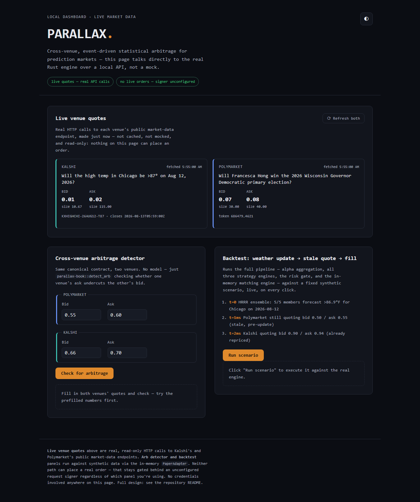

# PARALLAX

[](https://github.com/TemiKayode/parallax/actions/workflows/ci.yml)
[](LICENSE)

**PARALLAX** is a cross-venue, multi-asset, event-driven statistical arbitrage engine for prediction markets, written in Rust with `#![forbid(unsafe_code)]` on every crate. It watches [Kalshi](https://kalshi.com) and [Polymarket](https://polymarket.com) — two prediction-market exchanges that list the same real-world outcomes — for cross-venue mispricing and stale quotes, and runs three concrete algorithmic trading strategies (market making, statistical arbitrage, liquidity sniping) through a fail-closed risk gate before anything reaches a matching engine. Full system design: [PARALLAX — Cross-Venue Prediction-Market Statistical Arbitrage: System Design](https://claude.ai/code/artifact/8922a0e2-37fa-4b76-affb-398dd1487c6e).

This repo is the reference implementation of that design. It's a working skeleton with real, tested logic in every layer — not a mockup: **244 Rust tests and 15 Python tests pass**, in both debug and release, clippy is clean with zero warnings, and the web dashboard pulls **real, live quotes** from Kalshi's and Polymarket's public market-data APIs alongside a CLI/dashboard demo that runs a full tick-to-fill scenario against the real engine, charging Polymarket's actual published taker fee on every fill (not a zero-cost idealization), with a risk gate that rejects some of its own ladder and a mark-to-market P&L net of those fees. What it is *not* yet is a live trading system: order *submission* to Kalshi and Polymarket is deliberately incomplete (see [Status](#status)) until request signing and the live payload shape are verified against each venue's current order-entry API — see [Production readiness](#production-readiness) for exactly what that gap means. Live **data** and live **trading** are different claims; this repo makes the first one honestly and does not make the second one at all. And even where the mechanics are fully real — the fee-aware backtest above included — a working pipeline is a different claim from a demonstrated edge; see [docs/GOING-LIVE.md](docs/GOING-LIVE.md) for why that distinction is the one that actually matters before funds are involved.



## Contents

- [Layout](#layout)
- [How a tick actually flows](#how-a-tick-actually-flows)
- [Quick start](#quick-start)
- [Run it from anywhere](#run-it-from-anywhere)
- [The web dashboard](#the-web-dashboard-parallax-ui)
- [Security architecture](#security-architecture)
- [Status](#status)
- [Production readiness](#production-readiness)
- [Before going anywhere near real funds](#before-going-anywhere-near-real-funds)
- [License](#license)

## Layout

```
crates/
  parallax-types       canonical contract schema, event/order/position types, shared validate() — pure data, no I/O
  parallax-bus         lock-free event bus (crossbeam ArrayQueue) wiring the pipeline's topics, Lossy/Critical topic classification
  parallax-book        consolidated cross-venue order book (deterministic BTreeMap) + direct arbitrage detection
  parallax-alpha       AlphaSource trait, fair-value aggregator, weather/econ/news/oracle sources, offline-config loading, forecast-quality tracking
  parallax-risk        the risk gate: reservation-aware position/notional limits, correlated-cluster netting, price collar, kill switches
  parallax-strategy    market making / stat-arb / liquidity sniping engines + online calibration
  parallax-venues      VenueAdapter trait, PaperAdapter (deterministic matching engine), Kalshi/Polymarket adapters, symbol registry
  parallax-sim         replay/backtest harness driving the real pipeline against historical/synthetic data
  parallax-cli         library + `parallax-demo`/`parallax-record` binaries: the synthetic scenario and the Stage 0 venue-data recorder
  parallax-cancel-all  `parallax-cancel-all` binary: the Stage 2 out-of-band cancel path — depends on parallax-venues only, nothing else
  parallax-ui          `parallax-ui` binary: the same scenario, served as a local web dashboard
offline/
  parallax_research/   Python: offline calibration for the constants baked into parallax-alpha
  tests/               pytest suite for the above
```

Every crate maps to a section of the design doc — see each crate's top-level doc comment for the exact cross-reference. Every crate also carries `#![forbid(unsafe_code)]` — the compiler, not a convention, is what keeps this codebase free of raw pointers, unchecked casts, and manual memory management.

## How a tick actually flows

The pipeline `parallax-sim::Backtest` wires together, exactly as the CLI demo and web dashboard run it — no step here is aspirational:

```
raw events (weather / econ / news / oracle)
        │
        ▼
  parallax-alpha  ──aggregate (inverse-variance + log-odds shift)──▶  FairValue
                                                                          │
  parallax-book  ◀──────────────────────── venue quotes                 │
        │                                                               │
        └──────────────────────────────▶  parallax-strategy  ◀─────────┘
                (market making / stat-arb / liquidity sniping)
                                       │
                                       ▼
                              parallax-risk  (the gate — can only veto)
                                       │
                                       ▼
                     parallax-venues  (PaperAdapter, or Kalshi/Polymarket
                                        once a real signer is configured)
```

Two things not pictured here on purpose: the newer crypto-market alpha sources and the tradable-edge/position-structure/relative-value modules exist and are tested, but nothing constructs and wires them into this diagram yet — see [Status](#status) for exactly what that means.

## Quick start

```bash
git clone https://github.com/TemiKayode/parallax.git
cd parallax
cargo test --workspace          # 244 Rust tests
cargo run -p parallax-cli       # terminal demo
cargo run -p parallax-ui        # web dashboard at http://127.0.0.1:7878
```

## Run it from anywhere

The two binaries don't need to run from inside the repo — `cargo install` puts them on your `PATH` (`~/.cargo/bin`, which the standard Rust installer already adds for you) so `parallax-demo` and `parallax-ui` work as plain commands from any directory, on any machine with Rust installed:

```bash
# directly from GitHub, no clone needed
cargo install --git https://github.com/TemiKayode/parallax parallax-cli parallax-ui

# or, from a local clone (e.g. while developing)
cargo install --path crates/parallax-cli
cargo install --path crates/parallax-ui
```

Then, from anywhere:

```bash
parallax-demo   # terminal report
parallax-ui     # opens the dashboard at http://127.0.0.1:7878
```

No Rust installed at all? The only other thing that runs standalone is the Python research suite — `pip install -r offline/requirements.txt && pytest` inside `offline/`. There's currently no prebuilt binary release; `cargo install` is the supported path (see [Production readiness](#production-readiness) for what a real release pipeline would still need).

## The web dashboard (`parallax-ui`)

A small local server (axum) that talks to the *real* engine over a JSON API — nothing in the UI is mocked or precomputed. It's a dark-mode institutional-trading-style interface: zero external JS/CSS dependencies, no build step, no CDN calls, and glowing green/red/amber status indicators throughout.

- **Live venue quotes** — on load, the server discovers a currently-open market in Kalshi's real `KXHIGHCHI` series ("highest temperature in Chicago" — the same underlying event the synthetic demo below is modeled on) and an active market on Polymarket, fetches each venue's live order book over a real HTTP call, and normalizes it with the exact same parsers (`parse_kalshi_orderbook`, `parse_polymarket_book`) that ship tested against fixtures in `parallax-venues`. Both venues' public market-data endpoints are unauthenticated, so this needs no API keys. Each side tries several candidate markets/tokens in order and returns the first with a genuinely two-sided book — a single thin or momentarily one-sided book is routine on a real live order book, not an error to surface on the first try. Each card renders a proportional two-sided depth bar (bid vs. ask size, plus the spread in both price and basis points), a freshness indicator (age since last fetch, color-coded green/amber/red) and the round-trip fetch latency in milliseconds, and auto-refreshes every 30 seconds with a visible countdown (toggleable). It's not a matched contract pair for arbitrage — Polymarket doesn't currently list an equivalent Chicago-temperature market — so the two cards show real, independent, live quotes rather than forcing a misleading "same contract" comparison. Requires outbound internet access; refresh anytime with the button, or let it auto-refresh.
- **Cross-venue arbitrage detector** — type in bid/ask/size for both venues, it calls `parallax-book::detect_arb` live (recomputing as you type, debounced) and shows whether a riskless edge exists and how much of it is actually executable at the depth quoted — a proportional buy/sell depth bar makes the constraining side visible at a glance. Manual input, synthetic — this is where you explore the mechanism on a genuinely matched contract pair, which the live panel above can't currently offer.
- **Backtest runner** — one button re-runs the full weather-update → stale-quote → fill scenario through the actual `parallax-sim::Backtest` pipeline (alpha aggregation, all three strategy engines, the risk gate, the matching engine) with a step-by-step pipeline progress indicator, then renders the full report: a net-PnL hero display, a gross-PnL-to-fees breakdown bar, a real equity-curve/drawdown chart (SVG, drawn from the engine's own recorded equity curve — not a mockup), fills, filled volume, gross notional traded, an interactive color-categorized histogram of *why* each order was rejected (kill switch, position/notional/price guard, data-integrity gate, or other), and open positions. Synthetic data via the in-memory `PaperAdapter`. If a critical bus topic ever drops an order ack mid-run, or a kill switch trips during the run, the panel shows a prominent glowing banner and a toast notification instead of a PnL number that shouldn't be trusted — the same rule `BacktestReport::headline()` enforces on the Rust side.
- Toast notifications surface network failures, venue rate limiting, and stale-quote warnings without interrupting the panel you're looking at.
- Loopback-only by default (`PARALLAX_UI_ALLOW_REMOTE=1` opts into binding all interfaces), with a request body cap, a bound on concurrent requests, a per-request timeout, a strict Content-Security-Policy and other hardened response headers, a `/health` endpoint, and a graceful shutdown on Ctrl+C — every route here is unauthenticated, and `/api/backtest` runs real work per request. See [Security architecture](#security-architecture) for the full list.

No order is ever placed by any panel — that stays gated behind `UnconfiguredKalshiSigner` / `UnconfiguredPolymarketSigner` regardless of which panel you're using.

## Security architecture

This isn't a bolt-on checklist — it's structural, and every claim below is backed by a test, a compiler flag, or a header you can verify with `curl -D -`:

- **Zero `unsafe` code, enforced by the compiler.** Every crate carries `#![forbid(unsafe_code)]` — a stray `unsafe` block anywhere in the workspace fails the build, not a review.
- **The risk gate is fail-closed and veto-only.** Nothing in `parallax-risk` can approve a trade; every check can only reject one. A dedicated reconciliation gate refuses *every* order until the venue's real position has been loaded, and kill switches use asymmetric authority: anything can *trip* one, but only an operator calling the explicitly-named `operator_reset_kill_switches` can clear one — nothing in the trading path resets its own fault.
- **Signers fail closed by construction.** `UnconfiguredKalshiSigner` and `UnconfiguredPolymarketSigner` refuse every signing request; a real signer is an explicit, separate opt-in, never a default.
- **No secrets are ever logged, serialized, or hardcoded.** Credential-bearing types deliberately omit `Debug`/`Serialize` derives, so the compiler — not a code-review policy — prevents them from leaking into a log line or a JSON error trace. `.gitignore` also excludes common key/wallet file patterns (`*.pem`, `id_ed25519*`, `wallet.json`, etc.).
- **The dashboard binds to loopback only by default**, requires an explicit `PARALLAX_UI_ALLOW_REMOTE=1` to listen on any other interface, and enforces a request body-size cap, a concurrent-request limit, and a per-request timeout via `tower` middleware — an unauthenticated, real-work-per-request API needs all three.
- **A strict Content-Security-Policy with no `unsafe-inline`**, plus `X-Content-Type-Options: nosniff`, `X-Frame-Options: DENY`, and a locked-down `Referrer-Policy`, verified against a page that ships zero inline `<script>`/`<style>` and zero external/CDN URLs — the policy matches what the page actually needs, not a looser default.
- **Every dynamic value the dashboard renders is escaped client-side** (`escapeHtml()`) before it touches the DOM, and every proportional bar/chart is filled in via CSSOM property assignment rather than an inline `style` attribute, so the CSP's `style-src` restriction actually holds instead of being quietly worked around.
- **Sanitized external payloads.** Kalshi and Polymarket responses are parsed through dedicated, fixture-tested parsers (`parse_kalshi_orderbook`, `parse_polymarket_book`) that reject malformed JSON and out-of-range values instead of trusting the wire format; order sizes are rejected outright above the `f64` mantissa's exact-integer range rather than silently rounded.

## Status

### Solid and tested

- **Canonical contract normalization** across venues (`parallax-types`, `parallax-book`) — proven by tests mapping a Polymarket-style metric listing and a Kalshi-style imperial listing to the identical canonical id, and confirming case differences, embedded punctuation, and a `Between` contract's own upper bound can no longer collide two economically different bets into one book entry.
- **Direct cross-venue arbitrage detection**, independent of any model (`parallax-book::detect_arb`), backed by a deterministic (`BTreeMap`) book so the same input always produces the same result.
- **The fair-value aggregator** (`parallax-alpha`): inverse-variance weighting with a disagreement term that widens the confidence band; staleness decay that only applies to estimates still actually unsettled (a finalized oracle resolution doesn't decay); a correlation haircut so N correlated sources don't pool as N independent ones; a directional log-odds signal (a scored headline) that shifts the pooled estimate instead of voting an absolute opinion into it.
- **Direction-aware alpha sources**: weather and econ price whichever of `GreaterThan`/`LessThan`/`Between` the contract actually asks; a Beta-Binomial posterior means a unanimous small ensemble is never reported as exactly certain; the oracle source respects UMA-style optimistic-oracle challenge windows (a disputed proposal produces no estimate at all).
- **The risk gate** (`parallax-risk`) — every check here is a veto, nothing in this crate can cause a trade:
  - reservations for *working* orders, not just filled positions, so a two-sided quote is charged its real worst case
  - correlated-cluster netting that's aware of contract direction
  - notional (not just contract-count) limits, and a price collar
  - session-loss/drawdown auto-trip into the kill switch, with trip and reset kept as separate, asymmetric authorities
  - a reconciliation gate that refuses every order until the venue's real position has actually been loaded
  - `check_batch`, which stops two strategy engines that each individually clear a limit from jointly blowing through it in the same tick

  The price collar is exercised for real in the demo backtest below: it rejects 6 of the market maker's 16 proposed orders because they'd quote near the fresh, confident fair value while Polymarket's own book is still showing the stale pre-update touch — the same shape of runaway-model/fat-finger order the collar exists to catch.
- **The three strategy engines** (`parallax-strategy`):
  - market making ladders off the consolidated fair value, half-spread floored at the real round-trip fee cost
  - stat-arb sizes by fractional Kelly for a binary contract, firing only when a venue price sits fully outside the confidence band
  - sniping takes exactly the resting size at a stale quote via IOC, only once PARALLAX's own fair value postdates the quote being taken
- **`PaperAdapter`** (`parallax-venues`), a real in-memory matching engine, not a stub: deterministic price-time priority; correct marketable-limit/resting-limit/IOC semantics; a resting order fills at *its own* price, not the aggressor's; optional queue-position/network-latency/fee-schedule modeling (`PaperConfig`) for honest (not front-of-queue, not zero-latency, not fee-free) backtest and shadow-mode P&L — `Backtest::new` takes this config explicitly rather than defaulting to the frictionless choice, so a caller measuring whether a strategy has edge has to opt into realism, not opt out of an idealization.
- **The full pipeline**, wired together in `parallax-sim::Backtest` and exercised by an integration test, the CLI demo, and the web dashboard — see [How a tick actually flows](#how-a-tick-actually-flows). A weather ensemble update shifts the fair value, a stale quote gets bought, the fill lands in the risk gate's position book with a fee charged and slippage recorded, and the report shows realized/unrealized/net PnL, an equity curve with max drawdown, and a histogram of why every rejected order was rejected.
- **Live market-data reads against both venues' real production APIs.** `KalshiAdapter::fetch_open_markets_for_series_raw` + `fetch_orderbook_raw` + `parse_kalshi_orderbook`, and `PolymarketAdapter::fetch_active_markets_raw` + `fetch_book_raw` + `parse_polymarket_book`, were run against `external-api.kalshi.com` and `clob.polymarket.com`/`gamma-api.polymarket.com` while building this — not just unit-tested against fixtures. Both parsers matched the real response shapes without any code changes required, and both dashboard endpoints fall back across several candidate markets/tokens rather than failing on the first thin book.
- **A hardened, fail-closed security posture** across the codebase and the dashboard — see [Security architecture](#security-architecture) for the specifics: zero `unsafe` code, a veto-only risk gate with asymmetric kill-switch authority, signers that refuse by default, no secrets ever logged or serialized, and a locally-bound dashboard with request limits, timeouts, and a strict CSP verified against its own zero-inline-content footprint.
- **A first step on `docs/GOING-LIVE.md`'s Stage 0** (`parallax-cli::run_edge_distribution`): the demo scenario run 200 times with the ensemble forecast, both venues' quoted prices, and queue position perturbed per seed, reporting mean/median/p10/p90 net PnL instead of one number — printed by `parallax-demo` alongside the single deterministic run. Still synthetic data with synthetic noise, not the recorded real venue book data Stage 0 ultimately calls for; it answers "is this sensitive to realistic-sized input noise," not "does this have edge in the real market." Execution latency is deliberately left unperturbed here — see the module doc comment in `edge_distribution.rs` for the idempotency gap that surfaced when an earlier version tried, which is a real finding in its own right.
- **A real venue-data recorder** (`cargo run -p parallax-cli --bin parallax-record`), the rest of that Stage 0 step: polls Kalshi's and Polymarket's real public market-data endpoints on an interval (default 10s) and appends normalized book snapshots to a JSONL file, in the exact `{"tick": {...}}` shape `parallax_sim::load_jsonl` already reads back for a backtest replay — verified end to end against the live APIs, not just fixtures. Lower fidelity than a real streaming feed (this repo has no websocket client, so it polls REST), but real data with real timestamps rather than synthetic noise, and it can run unattended for as long as you want a corpus to build up. Output defaults to `recordings/`, gitignored since it's a data capture, not source.
- **Stage 1's idempotency, persistence, and reconciliation mechanics** (`parallax-venues::execution`/`journal`, `parallax-sim::reconcile`), fully built and tested against `PaperAdapter` and controllable test doubles: `submit_idempotent` queries a venue by `ClientOrderId` before ever resending an order whose outcome came back ambiguous, and only resends once that query *confirms* the venue never received it — never on a guess. `OrderJournal` persists intent before every submit and outcome after, so `recover_unresolved` can answer "did I have an order out?" from disk after a crash, not from memory. `reconcile_startup` ties both to `RiskGate`'s pre-existing (until now, unused) `set_position`/`mark_reconciled` hooks: it only marks the gate ready to trade once every recovered order has a confirmed outcome, the venue's position fetch has succeeded, *and* its open-order listing has succeeded — any single failure leaves every order refused, by design. `VenueAdapter` gained three matching methods — `find_order_by_client_id`, `fetch_positions`, `list_open_orders` — real for `PaperAdapter`, and an explicit, loud "not yet implemented — verify against the venue's real query endpoint first" for `KalshiAdapter`/`PolymarketAdapter`, the same posture `submit`/`cancel` already took.
- **Stage 2's rails for when the software itself is the problem.** HTTP 425 ("Too Early" — a matching engine mid-restart) is now its own `ExecError::VenueRestarting` instead of folding into a generic rejection, so retry logic isn't tempted to hammer a recovering engine (`http::classify_status`, tested). `RateLimiter::with_reserved_for_cancel` holds back a configurable share of each adapter's self-throttled request budget — 2 of 8 tokens/sec, for both live adapters — so ordinary submit/quote traffic can never exhaust the capacity a cancel needs during a fault; `cancel()` on both adapters draws from that reserve specifically. A new, genuinely isolated crate, **`parallax-cancel-all`**, is the out-of-band cancel path itself: its `Cargo.toml` depends on `parallax-types` and `parallax-venues` only — no `parallax-strategy`/`parallax-risk`/`parallax-alpha`/`parallax-sim` anywhere in its dependency graph, verified with `cargo tree`, not just asserted — so a bug anywhere in the strategy stack cannot take the tool meant to save you from that bug down with it. `cargo run -p parallax-cancel-all` demonstrates the full list-open-orders-then-cancel-every-one mechanism today against a self-contained `PaperAdapter`. A `DeadmanSwitch` trait plus a tested heartbeat-loop runner (`parallax-venues::deadman`) scaffold Polymarket's venue-side dead-man switch — the doc's own highest-value Stage 2 control — with the heartbeat call itself held to the same "verify before depending on it live" standard as everything else not yet exercised against a real endpoint.
- **Stage 3's observability**, built on telemetry that mostly already existed uncollected. Every risk-gate decision now emits a `tracing` event (`parallax-sim::engine`) — an acceptance at debug, a rejection at info carrying the specific `RejectReason` and every field it fired on, so "the rule that fired" is a real, greppable log line, not an aggregate count; `parallax-demo` wires up a subscriber (quiet by default so the curated report stays readable, `RUST_LOG=parallax_sim=info` or `=debug` to see it). `parallax_sim::alerting` inspects reports this repo was already computing and had nowhere reading them for a divergence signal: `check_reconciliation` (a `reconcile_startup` pass that couldn't fully confirm), `check_feed_data_quality` (`ConsolidatedBook::rejected_ticks()` — tracked since early in this repo, with a comment literally reading "surfaced via the report" next to code that never surfaced it), `check_feed_staleness` (`RejectReason::FeedStale` occurrences), and `check_rejection_rate` against a caller-supplied baseline. `FeeVerifier` (`parallax_sim::fee_verification`) tracks consecutive modeled-vs-realized fee mismatches and only reports a halt-worthy `PersistentMismatch` after a configurable streak, not on the first rounding blip — deliberately takes `(modeled, realized)` pairs from the caller rather than reading a fee off `OrderAck` directly, since neither this repo nor the venues' docs have verified whether a real fill's fee arrives bundled with it or via a separate endpoint. `parallax_venues::export_fill_ledger`/`write_ledger_csv` turn the Stage 1 journal — which already amounts to a durable accounting record — into a proper per-fill CSV ledger by joining each fill outcome against the intent that produced it.
- **Stage 4's first step, stated exactly as honestly as it should be.** `parallax-record` now feeds every successfully-fetched real tick into a live `ConsolidatedBook` (the same validation path a real deployment's book would run) and tracks per-venue consecutive-fetch-failure streaks (`parallax_cli::FeedHealthMonitor`, same streak-not-single-blip design as Stage 3's `FeeVerifier`), alerting once a venue's feed is actually unhealthy rather than on one transient blip — verified live: ran it against both real APIs, zero data-quality or health alerts, exactly as a healthy feed should look. What this deliberately does **not** claim: this repo has no live alpha source (the weather/econ/news/oracle sources are demo- or offline-config-driven, not fed by a real external feed), and Kalshi's real `KXHIGHCHI` listing and Polymarket's real top-volume market are two different real-world events with no shared canonical contract id — so there is no strategy/risk pipeline to run against this feed yet, and this doesn't pretend otherwise. What it does genuinely, continuously exercise at zero financial risk: real HTTP connectivity, real rate limiting, real (occasional) malformed responses — precisely the class of bug Stage 4 says a backtest can't catch.

### Newer, and not yet wired into the live pipeline

- Three additional alpha sources for crypto up/down markets — `CorrelatedAssetSource` (residual against a driver asset), `OrderFlowImbalanceSource`, `ReferenceDistanceSource` (a barrier-probability model off a reference price) — are implemented and tested (`parallax-alpha`), and can be handed to `Backtest::new` like any other `AlphaSource`, but nothing currently constructs and registers them by default.
- A tradable-edge calculator (`parallax-strategy::edge`, walks real depth rather than pricing off the touch), a position-structure state machine (`parallax-strategy::position_structure`, seven states from flat through hedged-building to unwinding), and a relative-value monitor (`parallax-strategy::relative_value`) are implemented and tested as standalone modules, but no `StrategyEngine` currently consumes them — that's a real design decision (a new engine, or an extension of an existing one) still to be made, not a bug fix.

### Deliberately incomplete, and why

- `KalshiAdapter::submit` and `PolymarketAdapter::submit` build a structurally complete request — venue symbol resolved through a `SymbolRegistry`, a deterministic idempotency key, prices/sizes rounded to the venue's own tick/lot grid — but stop short of the live HTTP call. Both venues' order-*creation* payload shapes (as opposed to the market-data read shapes above, which are verified) were reconstructed from public documentation during this build, not exercised against a live endpoint — shipping unverified field names against an API that moves real money is the wrong tradeoff for a reference implementation.
- Both adapters require an explicit `KalshiRequestSigner` / `PolymarketOrderSigner` before they'll even attempt to submit *or cancel* — the default `UnconfiguredKalshiSigner` / `UnconfiguredPolymarketSigner` always refuses. RSA-PSS (Kalshi) and EIP-712 (Polymarket) signing over a key that can move funds is deliberately not hand-rolled here; wire in an audited implementation.
- Live market data is on-demand (fetched when the dashboard loads, you click refresh, or the 30-second auto-refresh timer fires), not a continuous streaming ingestion loop feeding `parallax-book`/`parallax-strategy` automatically — there's no WebSocket subscription, scheduler, or long-running process wiring live quotes into the risk-gated strategy pipeline yet. No FIX client or FPGA/kernel-bypass anything either — see [§2 of the design doc](https://claude.ai/code/artifact/8922a0e2-37fa-4b76-affb-398dd1487c6e) for why most of that infrastructure doesn't apply to these venues the way the original brief assumed, and what's realistic instead.
- No production deployment (hot-hot redundancy, PTP clock sync) — that's infrastructure work for when there's a real venue connection to make redundant.

## Production readiness

"Production ready" means two different things here, and only one of them is true today.

**As an open-source software project, yes:** the workspace builds clean, `cargo clippy --workspace --all-targets -- -D warnings` passes with zero warnings, `cargo fmt --all -- --check` passes, CI (`.github/workflows/ci.yml`) runs fmt + clippy + the full Rust and Python test suites on every push and PR, it's MIT licensed, and both binaries install and run from anywhere via `cargo install`. That's the bar this repo is held to and meets.

**As a system that trades real money, no — and it shouldn't claim to.** Beyond the signing/payload gaps listed in [Status](#status), going live would still need, at minimum:

- A compliance review of venue ToS, geofencing, and market-manipulation rules for your jurisdiction and account type — see the design doc's compliance section (§16). This is not legal advice and nothing in this repo constitutes it.
- Real request signing (RSA-PSS for Kalshi, EIP-712 for Polymarket) backed by real key management, tested against each venue's sandbox/demo environment before touching production credentials.
- Secrets handling for API keys that isn't "environment variables on a laptop" — a secrets manager, least-privilege access, and key rotation.
- Position reconciliation at startup and on a schedule: `RiskGate::set_position`/`mark_reconciled` exist and the gate refuses to trade until they're called, but the code that actually fetches each venue's real position and working orders at startup doesn't exist yet — reconciliation *readiness* is not reconciliation.
- The hot-hot redundancy, clock discipline, and monitoring/alerting described in design doc §14, none of which exists yet — right now there's one process, one region, and no failover.
- Verification of the fee schedules and rate limits baked into `parallax-types::FeeModel` and each adapter's `capabilities()` against the venues' current published numbers — both venues change these, and a stale fee model silently turns a profitable strategy unprofitable with no error anywhere.

Treat this repo as a correct, tested foundation to build that on, not as something to point at a funded account today. For the staged engineering plan — including the argument that proving the edge (not connectivity) is the real gating step — see [docs/GOING-LIVE.md](docs/GOING-LIVE.md).

## Before going anywhere near real funds

Read the design doc's compliance section and [docs/GOING-LIVE.md](docs/GOING-LIVE.md). This is engineering, not legal, compliance, or investment advice — venue terms of service, geofencing, and market-manipulation rules are real constraints that need a real review, and every API detail in the Kalshi/Polymarket adapters should be re-verified against current documentation before use, since both venues' APIs evolve.

## License

MIT — see [LICENSE](LICENSE).

---

<sub>**Keywords:** Rust arbitrage bot · prediction markets · statistical arbitrage · algorithmic trading · quantitative finance · Kalshi API · Polymarket API · market making · liquidity sniping · risk management system · kill switch · order book · backtesting engine · event-driven trading · fintech · trading dashboard.</sub>
